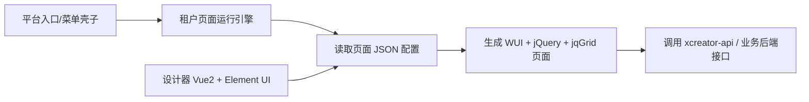

# XCreator 低代码平台接手手册

更新时间：2026-05-23  
范围：`电子档案台账` 页面及其所在 XCreator 低代码平台  
原则：生产环境只读分析，禁止无确认地保存、删除、提交、归档、导入导出。

## 1. 一句话结论

这个平台最后不是导出一个干净的 Vue/React 前端工程，而是：



二次开发的真实抓手有三类：

- 平台内配置：页面 JSON、组件属性、规则、交互事件、自定义脚本。
- 后端接口：`xcreator-api/engine-api/...` 以及业务系统接口。
- 外围新工程：保留接口和权限，另写独立前端，再通过菜单、iframe 或 openWindow 接入。

## 2. 生产环境安全边界

已确认这是生产正式系统。后续排查默认只做这些事：

- 可以看页面、DOM、已加载 JS、隐藏配置 JSON、只读静态资源。
- 可以打开页面、设计器、历史版本、规则页面进行只读观察，但不要保存。
- 可以抓取静态 JS 文件，例如 `platformMethod.js`、`designService.js`。
- 可以读运行态内联配置，例如 `_demoGrid_config`。

不要直接操作这些动作，除非明确得到业务确认：

- `保存数据`
- `保存`
- `保存并关闭`
- `删除`
- `归档公文`
- `下载归档包`
- `测试Zoffice`
- 导入、导出、提交、审批、PATCH/POST 业务动作

## 3. 关键入口和标识

主平台入口：

```text
http://xcreator.sz-mtrtest.com/xcreator-web/tenant-engine-page/pc/platform/acbbhqib/index
```

主平台：

```text
appCode: acbbhqib
```

电子档案台账页面：

```text
页面名称: 电子档案台账
appCode: saqzj2ho
appId: 1e231f4b-91e6-cdcd-1fe7-784e549acc4d
parentAppId: 9a8235c1-b02b-fb95-509a-c3e2c6e1fe91
pageCode: dzda
pageId: 28584ddd-5764-4448-b88c-b2cc01350e5a
pageUrl: /engine-page/saqzj2ho/dzda
platformType: pc
masterPageType: form
masterPageCode: list
```

运行态页面模式：

```text
/xcreator-web/tenant-engine-page/pc/platform/saqzj2ho/dzda
```

设计器页面模式：

```text
/xcreator-web/design/editor/index.html
  ?appId=1e231f4b-91e6-cdcd-1fe7-784e549acc4d
  &parentAppId=9a8235c1-b02b-fb95-509a-c3e2c6e1fe91
  &appCode=saqzj2ho
  &parentAppCode=saqzj2ho
  &pageId=28584ddd-5764-4448-b88c-b2cc01350e5a
  &pageName=电子档案台账
  &pageCode=dzda
  &pageUrl=/engine-page/saqzj2ho/dzda
  &platformType=pc
  &masterPageType=form
  &masterPageCode=list
  &tenantCode=platform
  &cwTenantCode=platform
  &cwAppToken=saqzj2ho
  &action=design
  &isBuildIn=true#/
```

注意：不要把 `cwUserToken` 或用户信息写进文档、截图、提交记录。

## 4. 技术栈判断

设计器：

- Vue 2.6.11
- Vuex 3.1.2
- Vue Router 3.1.5
- Element UI 2.13.0
- Axios 0.18.0

运行态页面：

- WUI
- jQuery
- jqGrid 5.1.1
- bootstrap-datetimepicker
- dropzone
- swfupload
- gallery
- 平台公共脚本：`platformMethod.js`、`platformEvent.js`、`platform.config.js`

这意味着：设计器像一个 Vue 后台，但真正业务页面是老式 jQuery/WUI 引擎渲染出来的。

## 5. 页面生成链路

设计器读取页面配置：

```text
GET /designManage/getMasterRenderData
参数通常包括 pageId、pageCode、appId、platformType
```

设计器保存页面配置：

```text
POST /designManage/savConfigContent
Content-Type: application/x-www-form-urlencoded
字段:
  appId
  pageId
  contentConfig = JSON.stringify(apiConfig.data)
```

设计器还可能改应用模型字段：

```text
PATCH /appData/alterAppModelData
body:
  tableName
  columns
```

运行态：

1. 访问 `/tenant-engine-page/pc/platform/{appCode}/{pageCode}`。
2. 页面注入 `Global`，包括 appCode、appToken、用户、租户、上下文路径等。
3. 加载 WUI、jqGrid 和平台公共脚本。
4. 把页面 JSON 配置展开成运行态变量，例如 `_demoGrid_config`。
5. WUI/jqGrid 根据配置渲染表格、查询区、操作列、按钮。
6. 按钮动作通过统一事件脚本分发成 openWindow、ajax、rule、download 等行为。

设计器请求拦截器会自动追加：

```text
cwUserToken = Global.userToken
cwAppToken = Global.appToken
```

## 6. 电子档案台账配置结构

`静态页面设计-电子档案台账` 页面里有隐藏字段 `configContent`，这是页面 JSON 蓝图。已读取到：

```text
configContent 长度: 约 28 KB
顶层 key:
  toolbarFragment
  gridFragment
```

当前自定义脚本内容：

```text
headScriptContent: 0
footScriptContent: 0
scriptContent: 0
styleContent: 0
isUseReviewVersion: 0
```

所以这个页面目前主要靠低代码配置和平台公共脚本运转，不是靠大量自定义 JS。

### 6.1 工具条 toolbarFragment

工具条块：

```text
id: demoToolbarDiv
type: block
```

按钮：

```text
id: btnScreen
type: linkButton
text: 筛选列
action: screen
```

```text
id: button401
type: button
text: 测试Zoffice
action: openWindow
pageCode: zi2whqbx/bizRequestMasterFlowForm_Z
```

`测试Zoffice` 是生产页面上的显眼风险按钮，未确认前不要点击。

### 6.2 表格 gridFragment

主表格：

```text
id: demoGrid
type: grid
serviceCode: acbbhqib/bizRequestMasterLedgeLists
运行态 serviceUrl: /xcreator-api/engine-api/acbbhqib/bizRequestMasterLedgeLists
rowNum: 10
isShowPageBar: true
isTreeGrid: false
localData: []
```

运行态变量：

```text
_demoGrid_config
```

主数据接口：

```text
/xcreator-api/engine-api/acbbhqib/bizRequestMasterLedgeLists
```

附件接口：

```text
/xcreator-api/engine-api/xFile/sysAttachmentGet
```

下载基础接口：

```text
/xcreator-web/base/download
```

字典查询接口：

```text
/xcreator-api/engine-api/xConfig/sysDictionaryItemQuery
```

### 6.3 表格列

当前表格列：

```text
ID          -> id              hidden=true
操作        -> demoId
公文标题     -> fileTitle
公文文号     -> documentNumber
立档单位名称  -> establishUnit
所属部门     -> applicantDept   search=true
归档员       -> archiverName
发文部门     -> applicantDept
归档日期     -> archiverDate    wstype=date
创建日期     -> createTime      wstype=date
业务号       -> bizNo           search=true
归档状态     -> archiverStatus  wstype=dictCode, dict=isArchive
审批状态     -> currentStatus   wstype=dictCode, dict=eleCurrentNodeStatus
```

注意：`所属部门` 和 `发文部门` 都使用 `applicantDept`，如果业务显示异常，需要确认是否是故意复用字段。

### 6.4 操作列按钮

删除：

```text
operationId: iconButton303
action: submit
title: 删除
```

归档公文：

```text
operationId: iconButton296
action: submit
title: 归档公文
显示条件: currentStatus == 35
配置 endpoint: /epcm-server/minio/EleTemplateController/passProcToAip
```

下载归档包：

```text
operationId: iconButton952
action: download
title: 下载归档包
显示条件: archiverStatus == 2
配置 endpoint: /epcm-server/minio/EleTemplateController/getAipFileFromMinio
```

严重风险点：运行态模板里出现了 `http://localhost:8081/epcm-server/...`。这是生产配置中疑似开发机地址泄漏。除非平台或客户端有特殊代理逻辑，否则普通用户点击时会访问自己电脑的 localhost，极可能失败或行为不可控。

## 7. 事件和按钮动作机制

平台公共事件脚本主要是：

```text
/xcreator-web/engine-page/common/platformEvent.js
```

常见动作函数：

```text
_doAjaxAction
_doRuleAction
_doOpenWindowAction
_doCloseWindowAction
_doOpenDialogAction
_doOpenFrameAction
_doTriggerEventAction
_doUserDefinedAction
```

AJAX 动作大致逻辑：

```text
actionConfig.serviceUrl -> _formatUrl -> wui.ajax

如果 ajaxConfig.action == "submit":
  校验表单
  wui.getForm()
  JSON.stringify(formData)
  发请求

成功后按 callbackType 分发:
  triggerEvent
  autoFill
  otherRule
  scripts
```

打开窗口动作大致逻辑：

```text
pageConfig.pageUrl -> _formatUrl -> wui.openWindow
```

打开弹层动作大致逻辑：

```text
pageConfig.pageUrl -> _formatUrl -> wui.openModalDialog
```

自定义动作：

```text
functionName -> eval(functionName + "(...)")
scripts -> eval("var _currentUserDefineFun = " + scripts)
```

这说明平台允许配置或脚本执行自定义 JS。排查生产问题时要重点看“自定义脚本”和“规则管理”。

## 8. URL 和 token 拼接规则

公共方法脚本：

```text
/xcreator-web/engine-page/common/platformMethod.js
```

关键方法：

```text
_getBuildUrlByToken(url)
_onBeforeSetup(settings, options)
_formatUrl(url, urlParams, placeData, option)
```

行为要点：

- 如果 URL 没有 `cwUserToken`，会从 `Global.userToken` 或当前 URL 参数里取。
- 如果 URL 没有 `cwAppToken`，会从 `Global.appToken` 或当前 URL参数里取。
- `_formatUrl` 会把当前页面 query 参数合并到目标 URL。
- 如果目标以 `/engine-page` 开头，会补成 `/xcreator-web/engine-page...`。
- URL 中的 `{字段名}` 这类占位会用当前数据行或页面数据替换。

## 9. 设计器常见能力入口

自定义脚本：

```text
/xcreator-web/engine-page/site/staticPageDesign
```

页面中会看到：

- 是否启用重构版本
- 头部脚本
- 尾部脚本
- html / javascript / css
- Monaco 编辑器
- 保存、保存并关闭、取消

规则管理：

```text
/xcreator-web/engine-page/gz/ruleRuleMain
```

规则选择：

```text
/xcreator-web/engine-page/gz/ruleRuleTree
```

历史版本：

```text
/xcreator-web/engine-page/site/fpjPageVersionList
```

历史版本读取：

```text
/xcreator-api/engine-api/site/fpjPageVersionGet/{pageVersionId}
```

组件渲染数据：

```text
/designManage/getWidgetRenderData
```

数据库字段查询：

```text
/xcreator-api/engine-api/model/mdlDbColumnQuery
```

服务选择：

```text
/xcreator-web/engine-page/service/svcServiceList?isSelectPage=1
```

页面选择：

```text
/xcreator-web/engine-page/site/fpjPageList?isSelectPage=1&platformType=pc
```

## 10. 二次开发建议路线

### 路线 A：平台内二开

适合：

- 改字段、列、按钮、搜索条件、字典、显示隐藏规则。
- 增加简单页面交互。
- 使用已有平台权限、菜单、附件、弹窗、字典。

做法：

1. 在测试环境复制应用或页面。
2. 保存当前页面 JSON 快照。
3. 通过设计器改配置。
4. 检查运行态 `_demoGrid_config` 是否符合预期。
5. 验证接口没有误指向生产或 localhost。

风险：

- 配置 JSON 可读性差。
- 平台升级可能影响运行态脚本。
- 自定义脚本用 eval，调试成本高。

### 路线 B：外围独立前端

适合：

- 页面复杂到低代码维护困难。
- 需要更好的交互、性能、工程化、测试。
- 想摆脱 WUI/jQuery/jqGrid。

做法：

1. 梳理主数据接口、字典接口、附件接口、权限接口。
2. 自己写 Vue/React 前端。
3. 复用平台登录态或后端 token 机制。
4. 通过平台菜单打开独立页面。

风险：

- 需要补齐平台封装能力。
- 权限、字典、附件、流程、日志要重新对齐。

### 路线 C：混合二开

适合当前最稳妥的过渡方案：

- 老页面继续跑平台。
- 新复杂功能做独立页面。
- 通过 openWindow、iframe、菜单、按钮接入。
- 后端逐步规范化接口。

建议优先走这条。

## 11. 当前最值得处理的风险

1. 生产配置含 `localhost:8081`

   操作列的归档和下载接口指向 localhost。需要确认到底是配置错误，还是客户端本机服务、浏览器插件、内网代理的特殊约定。

2. `测试Zoffice` 出现在生产工具条

   名称明显像测试入口。需要确认是否应隐藏或下线。

3. 操作列存在 `删除`

   目前只读观察，不确认权限和确认弹窗前不要点击。

4. 字段复用

   `所属部门` 和 `发文部门` 都绑定 `applicantDept`，需要业务确认。

5. 页面逻辑散落

   真实逻辑分散在页面 JSON、运行态内联 JS、公共平台脚本、规则服务、后端服务里，接手时不能只看设计器表面。

## 12. 代理/VPN 说明

当前系统代理：

```text
127.0.0.1:10808
```

已将以下域名加入系统代理绕过：

```text
xcreator.sz-mtrtest.com
sz-mtrtest.com
*.sz-mtrtest.com
```

检查 PowerShell：

```powershell
$path = 'HKCU:\Software\Microsoft\Windows\CurrentVersion\Internet Settings'
Get-ItemProperty -Path $path -Name ProxyEnable,ProxyServer,ProxyOverride
```

如果 v2rayN 切换节点或模式，可能会重写系统代理例外，导致该站再次走代理。现象通常是访问异常、超时或 503。

## 13. 后续只读复核方法

优先看这个手册，不要重新全量扫。如果必须复核，只做以下只读动作。

### 13.1 看运行态页面

打开：

```text
http://xcreator.sz-mtrtest.com/xcreator-web/tenant-engine-page/pc/platform/saqzj2ho/dzda
```

检查页面源或 DOM 里：

```text
_demoGrid_config
```

重点字段：

```text
_serviceUrl
colModel
operation-id
_action
_params
```

### 13.2 看设计器配置

打开设计器后，进入 `自定义脚本`，只读查看隐藏字段：

```text
configContent
styleContent
scriptContent
headScriptContent
footScriptContent
isUseReviewVersion
```

不要点：

```text
保存
保存并关闭
保存数据
```

### 13.3 只读下载静态脚本

本机临时目录曾使用：

```text
%TEMP%\xcreator_static_readonly
```

示例命令：

```powershell
$dir = Join-Path $env:TEMP 'xcreator_static_readonly'
New-Item -ItemType Directory -Force -Path $dir | Out-Null

curl.exe --noproxy "*" -L -s `
  "http://xcreator.sz-mtrtest.com/xcreator-web/engine-page/common/platformMethod.js" `
  -o (Join-Path $dir 'platformMethod.js')

curl.exe --noproxy "*" -L -s `
  "http://xcreator.sz-mtrtest.com/xcreator-web/engine-page/common/platformEvent.js" `
  -o (Join-Path $dir 'platformEvent.js')
```

搜索关键词：

```powershell
rg -n "_demoGrid_config|bizRequestMasterLedgeLists|passProcToAip|downloadZip|localhost:8081|savConfigContent|getMasterRenderData|alterAppModelData" $dir
```

## 14. 接手时的最短排查清单

1. 先确认是不是生产环境。
2. 先确认代理绕过还在不在。
3. 只打开页面，不点业务按钮。
4. 看 `appCode/pageCode/pageId/appId` 是否还是本手册记录的值。
5. 看 `configContent` 顶层结构是否还是 `toolbarFragment + gridFragment`。
6. 看运行态 `_demoGrid_config._serviceUrl` 是否还是主接口。
7. 看操作列是否仍有 `localhost:8081`。
8. 看自定义脚本是否仍为空。
9. 看规则管理是否新增了规则。
10. 真要改，先复制到测试环境或创建页面副本。

## 15. 推荐下一步

如果要真正开始二开，建议先做一个“页面资产快照”，包含：

- 页面 JSON 配置快照。
- 运行态 `_demoGrid_config` 摘要。
- 表格列字段清单。
- 按钮动作清单。
- serviceCode 到真实 URL 的映射。
- 规则管理清单。
- 自定义脚本清单。
- 后端接口样例响应，脱敏保存。

然后在测试环境验证一轮“改一列、加一个只读按钮、改一个查询条件”的完整闭环。跑通这个闭环后，再决定继续平台内二开还是独立前端重写。
