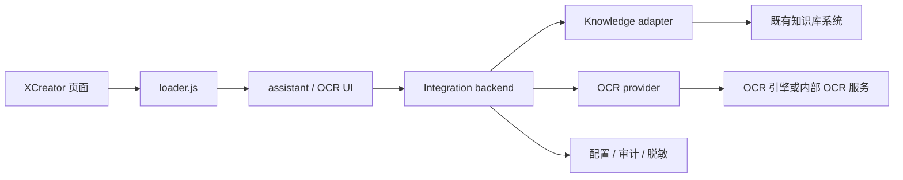

# XCreator 项目备忘

更新时间：2026-05-25  
主题：知识库助手与 OCR 自动填充如何接入 XCreator 低代码平台

## 1. 当前结论

已经探索确认：XCreator 低代码平台具备接入知识库助手和 OCR 自动填充的技术入口。

推荐方案不是改一大堆平台源码，也不是把复杂逻辑写死在低代码页面里，而是：

```text
XCreator 页面
  -> 页面自定义脚本 / openWindow / iframe / 按钮 / 上传控件增强
  -> 加载轻量 loader
  -> loader 读取页面上下文
  -> 调我们自己的后端 adapter/service
  -> 后端对接既有知识库系统或 OCR 服务
```

一句话：**低代码页面做入口，loader 做桥，后端服务承接真正能力。**

## 2. 已确认的平台事实

已从设计器、运行态页面、页面 JSON 和静态脚本中确认：

- XCreator 运行态页面不是普通 Vue/React 工程，而是 `WUI + jQuery + jqGrid`。
- 页面由低代码 JSON 配置生成，例如 `toolbarFragment`、`gridFragment`。
- 设计器有 `自定义脚本 / 静态页面设计` 入口，可以挂额外脚本。
- 运行态会注入 `Global`，可读取页面和应用上下文，例如 `appCode`、`pageCode`、`pageId`、tenant 等。
- 平台已有 `openWindow`、iframe、弹窗、按钮 action、附件上传/下载等机制。
- 页面按钮本来就通过配置里的 `openWindow / submit / download / screen` 等 action 触发。
- 运行态配置中能看到通用附件能力，例如上传、下载、附件查询端点。

因此，接入点是存在的。

## 3. 知识库助手怎么接

知识库看起来不是要我们从零造一套，而是应该对接一个既有知识库系统。

所以这里应预留 adapter，而不是重做知识库：

```text
XCreator 悬浮球
  -> assistant backend
  -> knowledge adapter
  -> 既有知识库系统
```

页面侧只负责：

- 展示悬浮小球或入口按钮。
- 读取当前页面上下文。
- 发起提问。
- 展示答案、引用来源、错误状态。

后端 adapter 负责：

- 对接既有知识库系统接口。
- 处理鉴权。
- 处理用户/角色/租户/页面范围。
- 统一返回答案、引用、状态码。
- 做日志脱敏和审计。

知识库未接通前支持三种模式：

```text
disabled: 不显示或显示不可用
stub: 使用测试答案跑通 UI 和流程
live: 连接真实知识库系统
```

当前缺口：

- 既有知识库系统名称和负责人。
- 问答或搜索 API。
- 鉴权方式。
- 是否支持引用来源。
- 权限过滤方式。
- 测试环境地址。

## 4. OCR 怎么接

OCR 不建议做孤立页面。

正确方式是挂在现有系统里“上传照片/附件/证件”的地方：

```text
用户上传证件/照片
  -> 旁边出现“识别”
  -> OCR 识别字段
  -> 弹出草稿确认
  -> 用户确认后填入当前表单字段
  -> 用户自己点保存
```

OCR 必须遵守：

- 只识别。
- 只生成草稿。
- 只在用户确认后填字段。
- 不自动保存。
- 不自动提交。
- 不触发删除、归档、下载、审批等业务动作。

可选接入模式：

```text
上传前识别: 选择本地文件后先 OCR
上传后识别: 正常上传成功后，用附件 ID 或下载地址 OCR
已有附件识别: 对已上传附件重新 OCR
```

优先建议：**上传后识别**。因为它最不破坏原上传流程。

当前缺口：

- 第一个 OCR 试点页面。
- 该页面的上传控件 ID/selector。
- 附件 ID 或下载/预览接口。
- 要自动填充的字段 ID/selector。
- 证件/照片类型。
- 非敏感测试图片。

## 5. 电子档案台账的判断

当前已看过的 `电子档案台账` 是列表页，不适合做 OCR 第一个落点。

它有：

- 表格。
- 筛选。
- 操作列。
- 通用附件上传/下载配置痕迹。

但没有：

- 明确的证件照片上传控件。
- 明确的表单字段填充区域。

所以 OCR 应该找具体表单页，而不是从这个台账列表页开始。

## 6. 当前 OCR 试点页发现状态

2026-05-25 继续只读探索时确认：

- 系统代理例外曾被重写，XCreator 域名绕过规则需要先恢复。
- 直连 XCreator 域名可达，但当前 Chrome 自动化 profile 未登录，会跳到统一登录页。
- 匿名访问页面管理、模块管理、设计配置、页面树等接口会返回缺少 `userToken` 或未授权。
- Chrome 历史里没有更多“上传、照片、附件、证件、资质、证书”相关业务页面。
- 目前不能靠匿名接口批量扫出 OCR 试点页面。

因此，寻找 OCR 第一个试点页面需要以下任一入口：

```text
1. 用户在已登录 Chrome 里打开一个具体表单页
2. 用户提供菜单路径或页面 URL
3. 用户提供测试环境/克隆页面的登录态
4. 平台管理员提供页面列表导出或 app/page 配置清单
```

在没有这些入口前，继续扫生产系统只能停在登录和权限边界，不应尝试绕过登录或复用历史 token。

## 7. 推荐落地路径

建议按这个顺序推进：

1. 找一个测试/克隆页面，不能直接在生产正式页试。
2. 找一个真实有上传照片/证件/附件的表单页。
3. 只读摸清页面配置：
   - `appCode`
   - `pageCode`
   - `pageId`
   - 上传控件
   - 附件字段
   - 需要自动填的表单字段
   - 保存/提交按钮，明确避开
4. 先挂 loader。
5. 知识库先跑 `stub`。
6. OCR 先跑“识别 -> 草稿 -> 确认填字段”。
7. 验证不会触发保存/提交/归档/删除。
8. 再接真实知识库和真实 OCR 服务。
9. 通过 feature flag 控制页面启用。
10. 最后才考虑生产灰度。

## 8. 推荐架构



## 9. 安全边界

生产环境不要直接试这些动作：

- 保存。
- 提交。
- 删除。
- 归档。
- 下载归档包。
- 导入导出。
- 审批。
- 任何会改业务数据的按钮。

调研和试点应坚持：

- 先只读。
- 先测试环境。
- 先 stub。
- 先 feature flag。
- token 和账号信息不进文档、不进日志。

## 10. VPN / 代理解耦

这个平台访问必须注意代理/VPN 问题。之前已经遇到过：系统代理指向本机代理端口时，XCreator 域名如果走代理，页面可能打不开、超时或出现异常。

目标状态：

```text
xcreator.sz-mtrtest.com 不走系统 VPN/代理
sz-mtrtest.com 不走系统 VPN/代理
*.sz-mtrtest.com 不走系统 VPN/代理
```

Windows 系统代理例外里应包含：

```text
xcreator.sz-mtrtest.com;sz-mtrtest.com;*.sz-mtrtest.com
```

PowerShell 检查命令：

```powershell
$path = 'HKCU:\Software\Microsoft\Windows\CurrentVersion\Internet Settings'
Get-ItemProperty -Path $path -Name ProxyEnable,ProxyServer,ProxyOverride
```

判断重点：

- `ProxyEnable` 可以仍然是开启状态。
- `ProxyServer` 可能是本机代理，例如 `127.0.0.1:10808`。
- 关键是 `ProxyOverride` 里必须有 XCreator 相关域名。

注意：

- v2rayN 或类似代理工具切换节点/模式时，可能会重写系统代理例外。
- 如果平台突然打不开，先检查代理例外，不要立刻怀疑平台代码或低代码配置。
- 后续自动化、接口探测、Chrome 页面探索都应先确认该域名绕过代理。

## 11. 相关文档

- `docs/xcreator-lowcode-platform-handbook.md`
- `openspec/changes/add-xcreator-assistant-and-ocr-autofill/proposal.md`
- `openspec/changes/add-xcreator-assistant-and-ocr-autofill/design.md`
- `openspec/changes/add-xcreator-assistant-and-ocr-autofill/knowledge-adapter-contract.md`
- `openspec/changes/add-xcreator-assistant-and-ocr-autofill/ocr-upload-integration-notes.md`
- `openspec/changes/add-xcreator-assistant-and-ocr-autofill/tasks.md`
- `docs/xcreator-ocr-and-assistant-discovery-20260525.md`
- `docs/xcreator-target-page-baseline-20260525.md`
- `docs/xcreator-integration-deployment-runbook.md`
- `xcreator_integration/`
