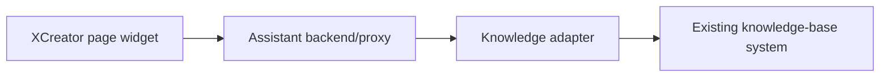

## Knowledge Adapter Contract Draft

This document defines the reserved interface between the XCreator assistant widget and the existing knowledge-base system. It is intentionally vendor-neutral because the actual knowledge system has not been confirmed yet.

## Modes

The assistant integration supports three modes per tenant/app/page:

```text
disabled: widget hidden or shown as unavailable
stub: local/test answers for UI and permission-flow testing
live: calls the configured existing knowledge-base adapter
```

Production pages MUST remain `disabled` until endpoint, authentication, permission behavior, and citation format are confirmed.

## Backend Boundary

The browser widget SHOULD NOT call the knowledge-base system directly. It should call an assistant backend/proxy owned by this integration:



Reasons:

- Keep knowledge credentials out of the browser.
- Normalize different knowledge-system response formats.
- Redact tokens and audit requests centrally.
- Enforce tenant/app/page/role scope.

## Configuration Contract

The widget fetches feature config from the assistant backend.

```http
GET /api/xcreator-assistant/config?tenantCode=platform&appCode=saqzj2ho&pageCode=dzda&pageId=28584ddd-5764-4448-b88c-b2cc01350e5a
```

Response draft:

```json
{
  "assistant": {
    "enabled": true,
    "mode": "stub",
    "entry": "floating",
    "adapterAlias": "enterprise-kb-main",
    "title": "知识助手",
    "placeholder": "请输入你想查询的问题"
  },
  "scope": {
    "tenantCode": "platform",
    "appCode": "saqzj2ho",
    "pageCode": "dzda",
    "pageId": "28584ddd-5764-4448-b88c-b2cc01350e5a"
  }
}
```

## Ask API

The widget sends user questions to the assistant backend. The backend calls the existing knowledge system through the adapter.

```http
POST /api/xcreator-assistant/ask
Content-Type: application/json
```

Request draft:

```json
{
  "question": "电子档案台账的归档状态是什么意思？",
  "conversationId": "optional-client-generated-id",
  "scope": {
    "tenantCode": "platform",
    "appCode": "saqzj2ho",
    "pageCode": "dzda",
    "pageId": "28584ddd-5764-4448-b88c-b2cc01350e5a",
    "roleCodes": ["optional-redacted-role-code"]
  },
  "pageContext": {
    "pageTitle": "电子档案台账",
    "selectedRecordType": "optional",
    "visibleLabels": ["公文标题", "归档状态", "审批状态"]
  }
}
```

Response draft:

```json
{
  "status": "answered",
  "answer": "归档状态表示档案包是否已完成归档处理。请以系统配置和业务制度为准。",
  "sources": [
    {
      "sourceId": "kb-doc-123",
      "title": "电子档案业务操作手册",
      "section": "归档状态说明",
      "url": "optional-internal-source-url",
      "snippet": "归档状态用于表示...",
      "score": 0.82
    }
  ],
  "traceId": "assistant-trace-id"
}
```

Status values:

```text
answered
unsupported
adapter_unavailable
permission_denied
invalid_request
error
```

Unsupported response draft:

```json
{
  "status": "unsupported",
  "answer": "知识库中没有找到足够依据回答这个问题。",
  "sources": [],
  "traceId": "assistant-trace-id"
}
```

## Source Lookup API

If the existing knowledge system supports source preview, the adapter can expose a normalized lookup endpoint.

```http
GET /api/xcreator-assistant/sources/{sourceId}
```

Response draft:

```json
{
  "sourceId": "kb-doc-123",
  "title": "电子档案业务操作手册",
  "sections": [
    {
      "section": "归档状态说明",
      "snippet": "归档状态用于表示..."
    }
  ],
  "viewUrl": "optional-internal-source-url"
}
```

## Health API

```http
GET /api/xcreator-assistant/adapters/{adapterAlias}/health
```

Response draft:

```json
{
  "adapterAlias": "enterprise-kb-main",
  "status": "ok",
  "capabilities": {
    "ask": true,
    "search": true,
    "sourceLookup": true,
    "citations": true,
    "permissionScoped": true
  }
}
```

Production enablement requires health status `ok`.

## Adapter Questions To Resolve

- Read-only discovery on 2026-05-25 found an existing app-tree node named `智能小助手后台`.
- Its related backend pages include access records, system configuration, report statistics, and feedback records.
- This suggests there is already an assistant/knowledge backend footprint, but the live ask/search API, owner, auth mode, and citation schema are still unconfirmed.
- What is the existing knowledge-base system name and owner?
- Is there an existing ask/search API, or only document search?
- How does authentication work: backend service token, OAuth, SSO session, or platform token exchange?
- How are tenant/app/role permissions passed and enforced?
- Does the system return citations, source IDs, snippets, document URLs, and scores?
- Can the knowledge system answer directly, or should this integration generate the final answer from retrieved sources?
- What are request limits, timeout expectations, and audit requirements?
- Can source previews be opened from XCreator, or must they stay inside the knowledge system UI?
