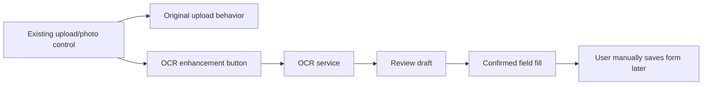

## OCR Upload Integration Notes

This document describes how OCR should be integrated into existing XCreator photo/attachment upload locations.

## Principle

OCR is an enhancement beside existing upload controls, not a replacement for upload.



The OCR flow MUST NOT trigger save, submit, delete, archive, download, approve, or other business actions.

## Integration Patterns

### Pattern A: Recognize Before Upload

The user selects a local file, OCR runs from the selected file, then the original upload can continue.

Pros:

- OCR can work before attachment IDs exist.
- Good for pages where upload is optional or delayed.

Cons:

- Harder to integrate if the existing upload widget hides the native file input.
- Must avoid interrupting the original file chooser flow.

### Pattern B: Recognize After Upload

The user uploads normally. OCR uses the generated attachment ID or download URL to retrieve a copy server-side.

Pros:

- Preserves the original upload behavior most cleanly.
- Better audit trail because the OCR job references an existing business attachment.

Cons:

- Requires permissioned server-side access to uploaded files.
- OCR result is available only after upload succeeds.

### Pattern C: Recognize Existing Attachment

The user selects an already uploaded attachment and starts OCR.

Pros:

- Useful for existing records.
- Avoids repeated upload.

Cons:

- Needs reliable attachment listing and preview/download integration.

Recommended first path: Pattern B if the platform exposes stable attachment IDs/downloads; otherwise Pattern A for a cloned test page.

## Upload Slot Configuration

Each OCR-enabled upload location should have a stable slot config.

```json
{
  "tenantCode": "platform",
  "appCode": "exampleApp",
  "pageCode": "exampleForm",
  "pageId": "example-page-id",
  "uploadSlotId": "idCardFrontPhoto",
  "enabled": true,
  "documentTypes": ["id-card-front"],
  "attachmentSource": {
    "mode": "post-upload",
    "uploadWidgetSelector": "#idCardFile",
    "attachmentIdField": "idCardAttachmentId",
    "downloadEndpointAlias": "xcreator-base-download"
  },
  "fieldMappings": {
    "name": {
      "targetType": "widgetId",
      "target": "personName"
    },
    "idNumber": {
      "targetType": "widgetId",
      "target": "certificateNumber"
    },
    "address": {
      "targetType": "selector",
      "target": "#address"
    }
  }
}
```

## OCR Job API Draft

Start OCR from an uploaded attachment:

```http
POST /api/xcreator-ocr/jobs
Content-Type: application/json
```

```json
{
  "tenantCode": "platform",
  "appCode": "exampleApp",
  "pageCode": "exampleForm",
  "pageId": "example-page-id",
  "uploadSlotId": "idCardFrontPhoto",
  "documentType": "id-card-front",
  "source": {
    "type": "attachment",
    "attachmentId": "attachment-id-from-existing-upload"
  }
}
```

Start OCR from a local file selected through the enhancement:

```http
POST /api/xcreator-ocr/jobs
Content-Type: multipart/form-data
```

Fields:

```text
tenantCode
appCode
pageCode
pageId
uploadSlotId
documentType
file
```

Job response:

```json
{
  "jobId": "ocr-job-id",
  "status": "completed",
  "documentType": "id-card-front",
  "fields": {
    "name": {
      "raw": "张三",
      "normalized": "张三",
      "confidence": 0.98
    },
    "idNumber": {
      "raw": "4403********0012",
      "normalized": "4403********0012",
      "confidence": 0.95
    }
  },
  "warnings": []
}
```

## Review Panel Behavior

The review panel should show:

- The related upload control/attachment.
- OCR document type.
- Extracted fields.
- Confidence for each field.
- Target XCreator field for each mapped value.
- Unmapped values.
- Low-confidence warnings.
- Apply/cancel controls.

Default selection:

- High-confidence mapped fields can be preselected.
- Low-confidence fields MUST require manual selection or correction.
- Unmapped fields MUST NOT be applied automatically.

## Form Fill Behavior

Confirmed fill should:

- Locate the target field by mapping.
- Write the normalized value.
- Trigger the field's normal change event.
- Report fields that could not be resolved.
- Avoid touching hidden business action buttons.

Confirmed fill should not:

- Click save.
- Click submit.
- Click delete.
- Click archive/归档.
- Click download.
- Change unrelated fields.
- Delete or replace the original attachment unless explicitly configured.

## Upload Control Inventory Checklist

For each target page, record:

```text
pageName
appCode
pageCode
pageId
upload control label
upload widget id / selector
native file input present: yes/no
attachment id field / hidden field
download/preview endpoint
related form fields
save/submit button selectors to avoid
document type expected
sample non-sensitive test file
```

## First Pages To Identify

Need business input for first target upload locations. Good candidates are pages where:

- The user already uploads certificate/document photos.
- The same fields are manually typed after upload.
- The document type is predictable.
- OCR mistakes can be safely reviewed before save.
- There is a test/cloned page available.

## 2026-05-25 Candidate Inventory Update

Read-only configuration discovery found these useful candidates:

```text
uapSafetyEduFlowForm:
  appCode: acbbhqib
  pageId: 961be927-9412-3ba5-b8e0-6c4afb1c856b
  signal: eduFile / attachment iframe / common sysAttachmentList shape
  note: marked deprecated, use as technical reference only

certificateBorrowtest1FlowForm:
  appCode: pao1l0xs
  pageId: 018d69e7-a8b3-46e4-993a-c600ca75f678
  signal: flow form with attachment iframe shape
  note: confirm whether this is a test/clone app before use

certificateInfotest1Form:
  appCode: aji0nnjl
  pageId: 2f596471-0d6a-463f-a394-385b260a4ee8
  signal: certificateName, certificateNum, issueDate, status, descn field candidates
  note: strong mapping candidate, upload slot still needs confirmation

secUserManageForm:
  appCode: uuapv2
  pageId: 3ffb6e3d-829f-4018-aafc-63edf932994a
  signal: userName and identityId field candidates
  note: ID-card mapping candidate, upload slot still needs confirmation
```

For implementation safety, a local non-production smoke fixture now mirrors the `certificateInfotest1Form` field mapping shape:

```text
xcreator_integration/examples/cloned-page-smoke.html
```

## Current Read-Only Probe

The currently inspected `电子档案台账` runtime page is a list/grid page, not a good first OCR target.

Observed safely:

- It contains generic platform upload/download configuration inside grid column `editoptions`, including endpoints such as `/xcreator-web/base/upload/uploadFiles`, `/xcreator-web/base/download`, and `/xcreator-api/engine-api/xFile/sysAttachmentGet`.
- It does not expose a visible business photo/certificate upload control in the page body.
- Its visible controls are mainly table search/filter, grid operation buttons, and platform floating design/debug controls.

Implication:

- OCR should be piloted on a concrete form page that already asks the user to upload a certificate, document photo, qualification image, ID image, or similar attachment.
- The list page can remain useful as a navigation or lookup page, but it should not be the first OCR fill integration point.
